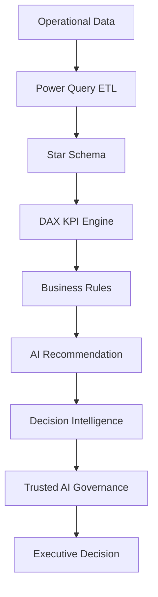

# AI Recommendation & Governance Architecture

## Overview

WorkForceIQ AI extends traditional business intelligence by incorporating an explainable, rule-based AI recommendation engine with a governance framework that promotes transparency, accountability, and responsible decision-making.

Unlike black-box AI systems, WorkForceIQ AI generates deterministic recommendations using enterprise business rules, ensuring every recommendation can be traced back to measurable operational KPIs.

---

# AI Architecture


---

# AI Decision Flow

```
Operational Data
        │
        ▼
Power Query ETL
        │
        ▼
Star Schema Data Model
        │
        ▼
Enterprise KPI Calculation (DAX)
        │
        ▼
Business Rule Evaluation
        │
        ▼
AI Recommendation Engine
        │
        ▼
Decision Intelligence
        │
        ▼
Trusted AI Governance
        │
        ▼
Executive Decision Support
```

---

# AI Recommendation Engine

The recommendation engine evaluates operational KPIs against predefined business thresholds.

Instead of machine learning predictions, the solution applies deterministic business logic to produce transparent and explainable recommendations.

Example recommendations include:

- Review SLA Compliance
- Increase Workforce Capacity
- Investigate Escalation Trends
- Reduce Backlog
- Optimize Queue Allocation
- Improve Workforce Utilization

---

# Rule Evaluation Process

The recommendation engine continuously evaluates enterprise KPIs including:

| KPI | Business Threshold |
|------|-------------------|
| SLA Compliance | Below 85% |
| Escalation Rate | Above 30% |
| Forecast Capacity | Below 90% |
| Executive Health Score | Below 70 |
| Agent Utilization | Above Target |

Whenever a KPI breaches its threshold, an appropriate recommendation is generated.

---

# Decision Intelligence Layer

Every recommendation is accompanied by supporting evidence.

The Decision Intelligence panel provides:

- Triggered KPI
- Current KPI Value
- Target Threshold
- Rule Triggered
- Recommended Action
- Decision Confidence
- Human Review Requirement
- Explainability Status
- Last Refresh Timestamp

This ensures complete traceability between operational data and executive recommendations.

---

# Explainability

Each recommendation clearly communicates:

- What triggered the recommendation
- Why the recommendation was generated
- Supporting KPI values
- Expected business impact

This eliminates "black-box" decision making and enables users to validate AI outputs.

---

# Governance Framework

The Trusted AI Governance Center evaluates every recommendation before implementation.

Governance indicators include:

- AI Governance Health Score
- Decision Trust Index
- Explainability Status
- Human Review Requirement
- Decision Intelligence
- Human Oversight Statement

These indicators help decision-makers understand the reliability and governance status of AI-assisted recommendations.

---

# Human Oversight

WorkForceIQ AI is designed as a Decision Support System rather than an autonomous AI platform.

Recommendations are intended to support operational decision-making while ensuring that final approval remains with authorized business leaders.

Human oversight is mandatory for operational changes affecting workforce planning, staffing decisions, or SLA management.

---

# Responsible AI Principles

The solution aligns with key Responsible AI principles:

- Transparency
- Explainability
- Accountability
- Human Oversight
- Auditability
- Governance

---

# Current Architecture

Current Version

Rule-Based AI

Characteristics:

- Fully Explainable
- Deterministic
- Business Rule Driven
- Enterprise Governed
- Low Operational Risk

---


# Future Roadmap

Future versions may introduce:

- Machine Learning Forecast Models
- Azure AI Services
- Microsoft Fabric AI
- Copilot Integration
- Natural Language Querying
- Large Language Model Assisted Recommendations
- Automated Risk Scoring
- Real-Time Recommendation Engine

These enhancements will continue to operate under the existing governance framework to ensure transparency and responsible AI adoption.
---

# Current Limitations

The current AI recommendation engine is intentionally rule-based.

Current limitations include:

- No predictive machine learning models
- No anomaly detection algorithms
- No natural language interaction
- No real-time streaming analytics
- Recommendations depend on predefined business thresholds

This design was chosen to prioritize explainability, governance, and business transparency over model complexity.

---

# Why Rule-Based AI?

A deterministic rule engine was selected because it provides:

- Full explainability
- Easy business validation
- Repeatable decision logic
- Lower operational risk
- Easier governance
- Simpler auditing

This aligns with enterprise Responsible AI principles where transparency is often more valuable than opaque prediction models.