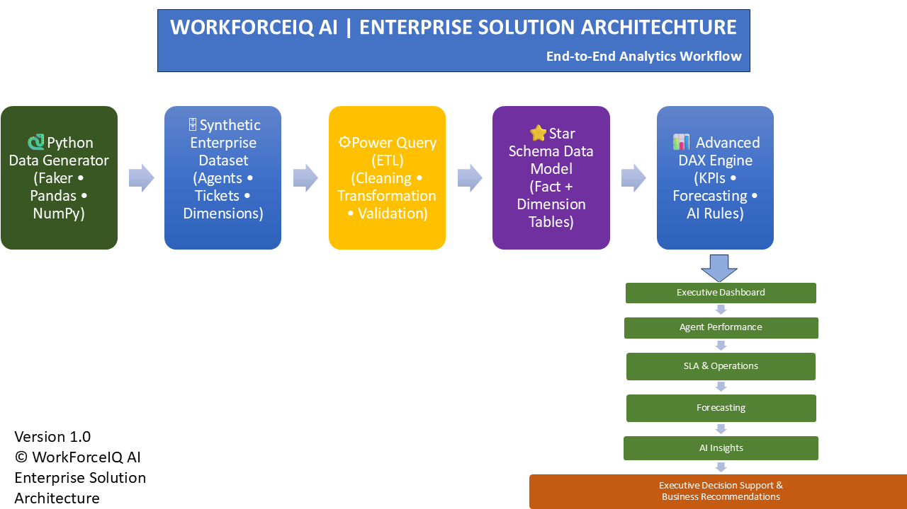

# 🏗 Enterprise Solution Architecture

## Overview

WorkForceIQ AI is an end-to-end enterprise workforce analytics platform designed to simulate a real-world customer support organization. The solution demonstrates the complete business intelligence lifecycle, beginning with synthetic data generation and progressing through data transformation, dimensional modeling, advanced analytics, interactive dashboards, and AI-driven executive insights.

The architecture follows modern enterprise BI best practices by separating data generation, ETL, data modeling, analytics, visualization, and decision support into distinct layers.

---

# Solution Architecture

---

# Architecture Layers

## 1️⃣ Data Generation Layer

The project begins with a Python-based synthetic data generator that simulates enterprise support operations.

**Technologies Used**

- Python
- Faker
- Pandas
- NumPy

**Generated Data**

- 100 Support Agents
- 1,000 Customer Support Tickets
- Operational KPIs
- Workforce Metrics

---

## 2️⃣ Data Processing Layer (ETL)

The generated datasets are imported into Power BI using Power Query.

Major ETL activities include:

- Data Cleaning
- Data Validation
- Data Transformation
- Derived Columns
- Business Rule Preparation

---

## 3️⃣ Data Modeling Layer

The transformed datasets are organized into an optimized Star Schema consisting of one central fact table and multiple dimension tables.

### Fact Table

- Fact_Tickets

### Dimension Tables

- Dim_Date
- Dim_Agent
- Dim_Queue
- Dim_Region

This model improves report performance, simplifies relationships, and supports reusable DAX calculations.

---

## 4️⃣ Analytics Layer

Business logic is implemented using advanced DAX measures.

The analytics engine includes:

- Executive KPIs
- SLA Compliance
- Escalation Rate
- Backlog Analysis
- Workforce Utilization
- Capacity Planning
- Forecasting
- What-If Analysis
- Executive Health Score
- AI Business Rules

---

## 5️⃣ Visualization Layer

The processed data is presented through five interactive Power BI dashboards.

### Executive Dashboard

Provides executive-level operational visibility through KPIs, trends, and organizational performance metrics.

### Agent Performance Dashboard

Analyzes workforce productivity, utilization, staffing efficiency, and team performance.

### SLA & Operations Dashboard

Monitors SLA compliance, backlog ageing, ticket escalations, and operational health.

### Forecasting & Planning Dashboard

Supports staffing planning using forecasting models and What-If analysis.

### AI Insights Dashboard

Generates dynamic recommendations using DAX-driven business rules and executive summaries.

---

## 6️⃣ Executive Decision Support

The final layer transforms operational metrics into actionable business recommendations.

The solution enables leadership teams to:

- Monitor operational performance
- Improve SLA compliance
- Optimize workforce allocation
- Forecast staffing demand
- Reduce operational costs
- Prioritize high-risk support queues
- Support strategic decision-making

---

# Technology Stack

| Layer | Technology |
|--------|------------|
| Programming | Python |
| Synthetic Data | Faker |
| Data Processing | Pandas, NumPy |
| ETL | Power Query |
| Data Modeling | Star Schema |
| Analytics | DAX |
| Forecasting | Power BI Forecasting + What-If Analysis |
| Visualization | Power BI |
| Documentation | Markdown |
| Version Control | Git & GitHub |

---

# End-to-End Workflow

Business Requirements

↓

Python Synthetic Data Generation

↓

Enterprise Dataset

↓

Power Query ETL

↓

Star Schema Modeling

↓

Advanced DAX Engine

↓

Interactive Dashboards

↓

AI Insights

↓

Executive Decision Support

---

# Business Value

The architecture demonstrates a complete enterprise analytics workflow that converts operational data into actionable executive insights. The platform showcases modern Business Intelligence practices, including dimensional modeling, advanced analytics, forecasting, interactive reporting, and AI-inspired decision support.

---

# Supporting Documentation

- Architecture Diagram
- Enterprise Star Schema
- Analytics Workflow
- KPI Dictionary
- Business Rules
- Data Model
- Project Roadmap

---

# Downloads

📄 Architecture Diagram (PDF)

🖥 Architecture Source (PowerPoint)

---

**Version:** 1.0

**Project:** WorkForceIQ AI

**Author:** Sowmika Kammili