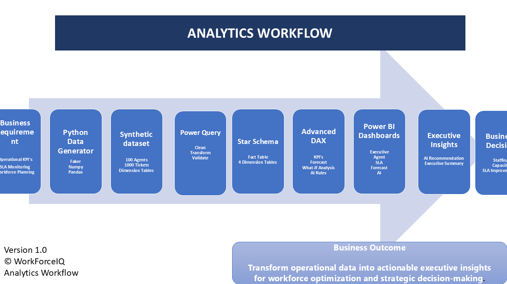

# Enterprise Solution Architecture

## Overview

WorkForceIQ AI is an enterprise workforce analytics platform designed to transform operational data into actionable business intelligence and AI-assisted recommendations.

The solution follows a modern analytics architecture consisting of data generation, transformation, modeling, business intelligence, and governance.

---

# Architecture Diagram

---

# End-to-End Workflow

---

# Solution Components

## 1. Synthetic Data Generation

The project begins with a Python-based synthetic data generator that simulates a real-world enterprise support environment.

Technologies:

- Python
- Faker
- Pandas
- NumPy

Outputs:

- Agents
- Customer Tickets
- Queue Information
- Operational Metrics

---

## 2. Data Storage

The generated datasets are exported as CSV files and organized into:

- Raw Dataset
- Processed Dataset
- Sample Dataset

These datasets simulate enterprise operational data.

---

## 3. Data Transformation

Power Query performs ETL operations including:

- Data cleansing
- Data type validation
- Missing value handling
- Derived columns
- Business transformations

---

## 4. Star Schema Data Model

The transformed data is modeled using a Star Schema.

Fact Table

- Tickets

Dimension Tables

- Agent
- Date
- Queue
- Region

This design improves reporting performance and simplifies DAX calculations.

---

## 5. Analytics Layer

The analytical engine is implemented using DAX.

Key capabilities include:

- Executive KPIs
- SLA Monitoring
- Forecasting
- Utilization Analytics
- Cost Analysis
- Capacity Planning

---

## 6. AI Recommendation Engine

Business rules analyze operational KPIs and generate recommendations.

Examples include:

- Review SLA Compliance
- Increase Staffing Capacity
- Investigate Escalation Trends
- Optimize Queue Allocation

The recommendation engine is fully explainable and based on deterministic business rules.

---

## 7. Trusted AI Governance

The governance layer ensures AI recommendations remain transparent and auditable.

Key features include:

- AI Governance Health Score
- Decision Trust Index
- Explainability Status
- Human Review Requirement
- Decision Intelligence
- Human Oversight Statement

This layer demonstrates responsible AI principles by ensuring recommendations support, rather than replace, human decision-making.

---

# Business Outcome

The solution enables leadership teams to:

- Monitor workforce performance
- Improve SLA compliance
- Optimize staffing
- Forecast operational demand
- Reduce backlog
- Support executive decision-making
- Govern AI-assisted recommendations

---

# Architecture Principles

The solution was designed around the following principles:

- Scalability
- Explainability
- Modularity
- Data Quality
- Performance
- Governance
- Business Alignment

---
---

# Architecture Design Decisions

| Decision | Rationale |
|----------|-----------|
| Python for synthetic data generation | Flexible, reproducible, and scalable dataset creation |
| Power Query for ETL | Native integration with Power BI and simplified transformations |
| Star Schema | Optimized analytical performance and simplified reporting |
| DAX for KPI calculations | Dynamic measures and business logic implementation |
| Rule-Based AI | Transparent, explainable, and deterministic recommendations |
| Governance Layer | Ensures responsible AI usage through explainability and human oversight |
| Power BI | Interactive enterprise reporting and executive dashboards |

# Future Enhancements

Future versions of WorkForceIQ AI may include:

- Microsoft Fabric
- Azure SQL Database
- Power BI Service Deployment
- Power Automate Alerts
- Real-Time Streaming
- Machine Learning Forecast Models
- REST API Integration
- Generative AI Assistant