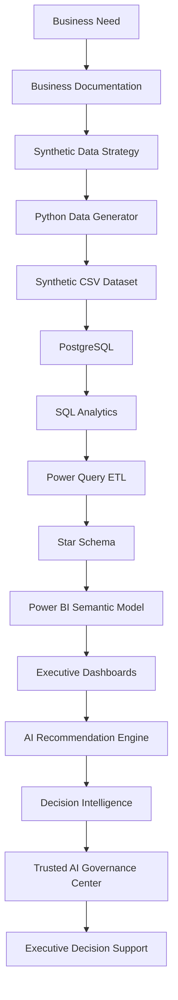

Business Need
        ↓
Business Documentation
        ↓
Synthetic Data Strategy
        ↓
Python Data Generator
        ↓
Synthetic CSV Dataset
        ↓
PostgreSQL
        ↓
SQL Analytics
        ↓
Power Query ETL
        ↓
Star Schema
        ↓
Power BI Semantic Model
        ↓
Executive Dashboards
        ↓
AI Recommendation Engine
        ↓
Decision Intelligence
        ↓
Trusted AI Governance Center
        ↓
Executive Decision Support

# Solution Evolution

