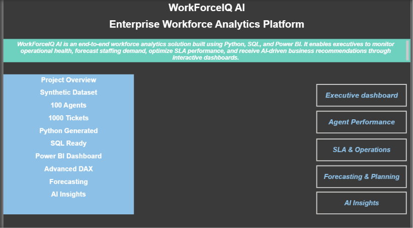
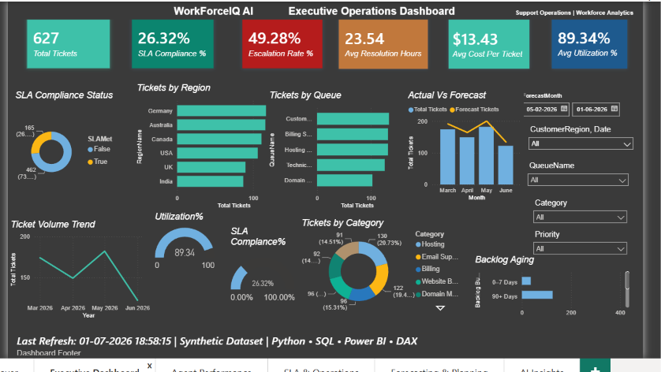
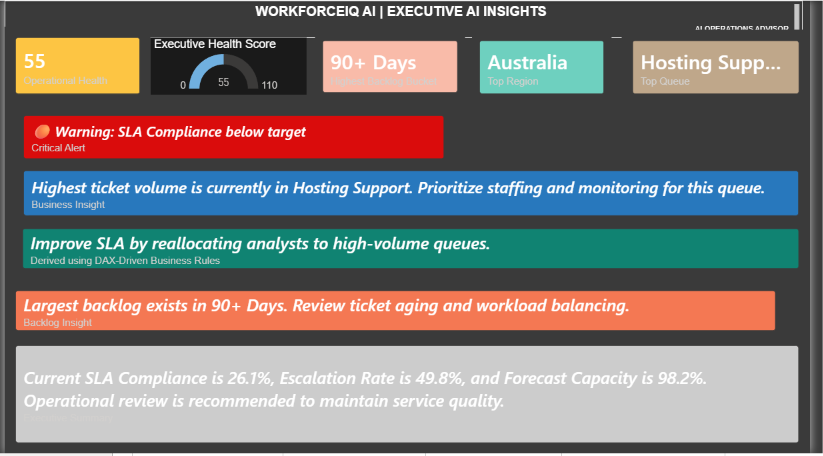

# 🚀 WorkForceIQ AI


## Enterprise Workforce Analytics Platform


## 📊 Project Statistics

| Metric | Value |
|---------|------:|
| Dashboards | 5 |
| Synthetic Agents | 100 |
| Customer Tickets | 1,000 |
| DAX Measures | 40+ |
| KPIs | 25+ |
| Documentation Files | 15+ |
| AI Recommendation Engine | Included |
| Forecasting | What-If Analysis |


An end-to-end workforce analytics solution built using **Python**, **SQL**, and **Power BI** to monitor operational performance, optimize workforce utilization, forecast staffing demand, and deliver AI-driven business recommendations.

---


## 📌 Project Overview

WorkForceIQ AI is a comprehensive analytics platform designed for enterprise support operations. It simulates a real-world customer support environment by generating synthetic operational data, modeling it using a star schema, and presenting actionable insights through interactive Power BI dashboards.

The platform enables business leaders to:

- Monitor operational KPIs in real time
- Analyze agent productivity and utilization
- Track SLA compliance and backlog trends
- Forecast staffing requirements
- Generate AI-inspired operational recommendations
- Support executive decision-making through data-driven insights

---

## 🎯 Business Problem

Enterprise support organizations process thousands of customer tickets every month. Leadership teams often struggle to answer critical operational questions such as:

- Are we meeting our SLA targets?
- Which support queues require additional staffing?
- Which agents are overutilized or underutilized?
- Where are ticket backlogs increasing?
- How many analysts will be required next month?
- How can operational costs be optimized while maintaining service quality?

Traditional reports answer these questions individually.

**WorkForceIQ AI consolidates them into a single executive analytics platform.**

---
## 🛠 Technology Stack

| Category | Technology |
|-----------|------------|
| Programming | Python |
| Data Processing | Pandas, NumPy |
| Synthetic Data | Faker |
| Database | SQL |
| Business Intelligence | Power BI |
| Data Modeling | Star Schema |
| ETL | Power Query |
| Analytics | DAX |
| Forecasting | Power BI Forecasting |
| Documentation | Markdown |
| Version Control | Git & GitHub |
## 🏗 Solution Architecture

## ⭐ Key Features

- Executive Operations Dashboard
- Agent Performance Analytics
- SLA & Compliance Monitoring
- Forecasting & Capacity Planning
- AI-Powered Executive Insights
- Interactive What-If Analysis
- Star Schema Data Model
- Advanced DAX Measures
- Dynamic KPI Calculations
- Python-Based Synthetic Data Generator
- Interactive Filters and Drilldowns
- Executive Health Score
- Dynamic Business Recommendations
## 📸 Dashboard Gallery
## Dashboard Gallery

### Executive Dashboard



---

### Agent Performance


---

### SLA & Operations


---

### Forecasting & Planning


---

### AI Insights


## 📂 Repository Structure

```text
WorkForceIQ-AI
│
├── 01_Documentation
├── 02_Dataset
├── 03_SQL
├── 04_PowerBI
├── 05_DAX
├── 06_Python
├── 07_AI
├── 08_CaseStudy
├── 09_Presentation
├── 10_Screenshots
├── 11_Resources
│
├── README.md
└── requirements.txt
```
## 📈 Dashboard Modules

### Executive Dashboard

Tracks operational KPIs, ticket trends, queue distribution, SLA performance and executive health metrics.

---

### Agent Performance Dashboard

Provides workforce utilization, productivity, staffing efficiency and team comparison.

---

### SLA & Operations Dashboard

Monitors SLA compliance, backlog ageing, escalation trends and resolution performance.

---

### Forecasting & Planning

Predicts staffing demand, operational cost and future workload using What-If analysis.

---

### AI Insights

Generates executive recommendations using DAX-driven business rules, highlighting operational risks and suggested actions.
## 💼 Business Value

This solution demonstrates how enterprise support organizations can leverage analytics to:

- Improve operational visibility
- Reduce SLA breaches
- Optimize workforce allocation
- Forecast staffing requirements
- Support executive decision-making
- Identify operational bottlenecks
- Reduce backlog growth
## 🚀 Future Enhancements

- Azure SQL Integration
- Microsoft Fabric Integration
- Power BI Service Deployment
- Power Automate Notifications
- Machine Learning Forecast Models
- Real-Time Streaming Dashboard
- API Integration
## 👩‍💻 About the Author

**Sowmika Kammili**

Data Analyst | Power BI Developer | SQL | Python | Business Intelligence

Passionate about transforming operational data into actionable business insights through analytics, automation, and modern BI solutions.

Feel free to connect:

- LinkedIn
- GitHub
